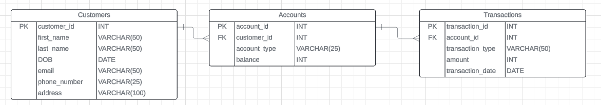

# Assignment

## Task 1: Database Design
1. Create the database named "HMBank"
~~~sql
    create database HMBank
    USE HMBank;
~~~

 2. Define the schema for the Customers, Accounts, and Transactions tables based on the provided schema.

 3. Create an ERD (Entity Relationship Diagram) for the database.

 4. Create appropriate Primary Key and Foreign Key constraints for referential integrity.

 5. Write SQL scripts to create the mentioned tables with appropriate data types, constraints, and relationships.• Customers • Accounts • Transactions
~~~sql
CREATE DATABASE HMBank;
Use HMBank;

CREATE TABLE Customer(
	customer_id INT,
	first_name VARCHAR(50),
	last_name VARCHAR(50),
	DOB DATE,
	email VARCHAR(50),
	phone_number VARCHAR(25),
	address VARCHAR(100)
	PRIMARY KEY(customer_id)
);

CREATE TABLE Accounts(
	account_id INT,
	customer_id INT,
	account_type VARCHAR(25),
	balance INT,
	PRIMARY KEY (account_id),
	FOREIGN KEY (customer_id) REFERENCES Customer(customer_id)
);

CREATE TABLE Transactions(
	transaction_id INT,
	account_id INT,
	transaction_type VARCHAR(50),
	amount INT,
	transaction_date DATE,
	PRIMARY KEY(transaction_id),
	FOREIGN KEY(account_id) REFERENCES Accounts(account_id)
);
~~~

## Task 2: Select, Where, Between, AND, LIKE:

1. Insert at least 10 sample records into each of the following tables.  • Customers • Accounts • Transactions 
i) Customer Table
~~~sql
INSERT INTO Customer (customer_id, first_name, last_name, DOB, email, phone_number, address) 
VALUES
(1, 'John', 'Doe', '1990-05-15', 'john.doe@example.com', '123-456-7890', '123 Main St, Cityville'),
(2, 'Jane', 'Smith', '1985-09-20', 'jane.smith@example.com', '987-654-3210', '456 Oak Ave, Townsville'),
(3, 'Michael', 'Johnson', '1978-03-10', 'michael.johnson@example.com', '555-123-4567', '789 Elm St, Villagetown'),
(4, 'Emily', 'Brown', '1995-12-28', 'emily.brown@example.com', '111-222-3333', '321 Pine St, Hamlet'),
(5, 'David', 'Wilson', '1982-07-04', 'david.wilson@example.com', '444-555-6666', '567 Maple Ave, Riverside'),
(6, 'Sarah', 'Martinez', '1993-01-22', 'sarah.martinez@example.com', '777-888-9999', '890 Cedar St, Lakeside'),
(7, 'Christopher', 'Anderson', '1970-11-18', 'chris.anderson@example.com', '222-333-4444', '901 Walnut St, Hilltop'),
(8, 'Amanda', 'Taylor', '1988-08-12', 'amanda.taylor@example.com', '666-777-8888', '234 Birch Ave, Meadow'),
(9, 'Robert', 'Garcia', '1980-04-30', 'robert.garcia@example.com', '999-111-2222', '543 Pine St, Sunset'),
(10, 'Michelle', 'Hernandez', '1991-06-25', 'michelle.hernandez@example.com', '333-444-5555', '876 Oak St, Sunrise');
~~~
 

2. Accounts Table

~~~sql
INSERT INTO Accounts (account_id, customer_id, account_type, balance) 
VALUES
('101', '1', 'savings','100000'),
('102', '2', 'current', '50000'),
('103', '3', 'savings', '75000'),
('104', '4', 'current', '120000'),
('105', '5', 'savings', '25000'),
('106', '6', 'current', '80000'),
('107', '7', 'savings', '300000'),
('108', '8', 'current', '60000'),
('109', '9', 'savings', '200000'),
('110', '10', 'zero_balance', '90000');
~~~

3. Transactions Table
~~~sql
INSERT INTO Transactions (transaction_id, account_id, transaction_type, amount, transaction_date) 
VALUES
(201, 101, 'Deposit', 1000, '2024-04-01'),
(202, 102, 'Withdrawal', 200, '2024-04-02'),
(203, 103, 'Deposit', 1500, '2024-04-03'),
(204, 104, 'Withdrawal', 500, '2024-04-04'),
(205, 105, 'Deposit', 800, '2024-04-05'),
(206, 106, 'Withdrawal', 1000, '2024-04-06'),
(207, 107, 'Deposit', 1200, '2024-04-07'),
(208, 108, 'Withdrawal', 300, '2024-04-08'),
(209, 109, 'Deposit', 2000, '2024-04-09'),
(210, 110, 'Withdrawal', 400, '2024-04-10');
~~~

2. Write SQL queries for the following tasks:

    1. Write a SQL query to retrieve the name, account type and email of all customers.

    ~~~sql
    select first_name+last_Name as name, email, account_type
    from customer
    INNER JOIN Accounts 
    ON customer.customer_id = accounts.customer_id;
    ~~~

    2.  Write a SQL query to list all transaction corresponding customer
    ~~~sql
    Select * 
    from Transactions
    inner join Accounts 
    on transactions.account_id=Accounts.account_id 
    inner join Customer on Accounts.customer_id=Customer.customer_id ;
    ~~~

    3. Write a SQL query to increase the balance of a specific account by a certain amount.
    ~~~sql
    Update Accounts 
	set balance=balance+2000
	where account_id=101;
    ~~~

    4. Write a SQL query to Combine first and last names of customers as a full_name.
    ~~~sql
    select first_name+' '+last_name as full_name
	from Customer;
    ~~~

    5. Write a SQL query to remove accounts with a balance of zero where the account type is savings.

    ~~~sql
	Delete
	from Transactions 
	where account_id=(
		Select account_id 
		from Accounts
		where balance=0 AND account_type='savings');
	Delete 
	from Accounts 
	where balance=0 AND account_type='savings';
    ~~~

    6. Write a SQL query to Find customers living in a specific city.
    ~~~sql
    Select *
	from customer 
	where address='456 Oak Ave, Townsville' ;
    ~~~

    7. Write a SQL query to Get the account balance for a specific account.
    ~~~sql
    select balance 
	from Accounts
	where account_id=102;
    ~~~

    8. Write a SQL query to List all current accounts with a balance greater than $1,000.
    ~~~sql
    select * 
	from Accounts 
	where account_type='current' AND balance>1000;
    ~~~

    9. Write a SQL query to Retrieve all transactions for a specific account.
    ~~~sql
    Select * 
	from transactions 
	where account_id=108;
    ~~~

    10.    Write a SQL query to Calculate the interest accrued on savings accounts based on a given interest rate.
    ~~~sql
    Select (balance*15)/100 
	from Accounts 
	where account_type='savings';
    ~~~

    11. Write a SQL query to Identify accounts where the balance is less than a specified overdraft limit.
    ~~~sql
    Select *
	from Accounts
	where balance<100000;
    ~~~

    12. Write a SQL query to Find customers not living in a specific city.
    ~~~sql
    Select *
	from Customer
	where address!='321 Pine St, Hamlet';
    ~~~

## Task 3: Aggregate functions, Having, Order By, GroupBy and Joins:

1. Write a SQL query to Find the average account balance for all customers.
~~~sql
select  AVG(balance),customer_id
from Accounts 
group by customer_id;
~~~

2. Write a SQL query to Retrieve the top 10 highest account balances.
~~~sql
select *
from accounts
order by balance desc offset 0 rows fetch next 10 rows only;
~~~

3. Write a SQL query to Calculate Total Deposits for All Customers in specific date.
~~~sql
select  distinct(transaction_date),sum(amount)as total_deposits
from transactions 
where transaction_type='deposit' 
group by transaction_date ;
~~~

4. Write a SQL query to Find the Oldest and Newest Customers.
~~~sql
select first_name+' '+last_name as name, DOB
from customer
where DOB  = (select MAX(DOB) 
			from Customer)OR
	  DOB = (select MIN(DOB)
			from Customer);
~~~

5. Write a SQL query to Retrieve transaction details along with the account type.
~~~sql
select t.*, a.account_type
from Transactions t
left join accounts a
on t.account_id=a.account_id; 
~~~

6. Write a SQL query to Get a list of customers along with their account details.
~~~sql
select a.*, c.first_name+' '+c.last_name as Name
from Customer c
left join accounts a
on c.customer_id = a.customer_id;
~~~

7. Write a SQL query to Retrieve transaction details along with customer information for a specific account.
~~~sql
select * 
from Transactions t
left join accounts
on t.account_id=accounts.account_id
where t.account_id = 101;
~~~

8. Write a SQL query to Identify customers who have more than one account.
~~~sql
select * 
from customer
where customer_id IN(
	select customer_id
	from Accounts
	group by customer_id
	having COUNT(account_id)>1
);
~~~

9. Write a SQL query to Calculate the difference in transaction amounts between deposits and withdrawals.
~~~sql
SELECT 
    (SELECT SUM(amount) FROM Transactions WHERE transaction_type = 'Deposit') - 
    (SELECT SUM(amount) FROM Transactions WHERE transaction_type = 'Withdrawal') AS difference;

~~~
10. Write a SQL query to Calculate the average daily balance for each account over a specified period.
~~~sql
select account_id, avg(balance) as average_daily_balance
from (select account_id, sum(balance) as balance
    from Accounts
    where date(transaction_date) between '2021-01-12' and '2021-01-14'
    group by account_id, date(transaction_date)
) as daily_balances
group by accounts account_id;
~~~

11. Calculate the total balance for each account type.
~~~sql
select sum(balance)as total_balance,account_type
  from accounts 
  group by account_type
~~~

12. Identify accounts with the highest number of transactions order by descending order.
~~~sql
    select account_id 
    from transactions 
    group by account_id
     order by count(account_id) desc;
~~~

13. List customers with high aggregate account balances, along with their account types.
~~~sql
    select c.first_name,c.last_name,sum(a.balance) as aggregate_balance,a.account_type
     from Customer as c 
     inner join Accounts as a 
     on c.customer_id=a.customer_id 
	group by c.first_name,c.last_name,a.balance ,a.account_type
	order by a.balance desc;
~~~

14. Identify and list duplicate transactions based on transaction amount, date, and account.
~~~sql
    select transaction_id, account_id, transaction_type, amount, transaction_date
from Transactions
where (amount, transaction_date, account_id) in (
    select amount, transaction_date, account_id
    from Transactions
    group by amount, transaction_date, account_id
    having count(*) > 1
);
~~~

## Tasks 4: Subquery and its type:
1. Retrieve the customer(s) with the highest account balance.
~~~sql
select * 
from customer 
where customer_id in(
    select customer_id 
    from accounts 
    where balance=(select max(balance) 
    from accounts));
~~~

2. Calculate the average account balance for customers who have more than one account.
~~~sql
	select avg(balance),customer_id 
    from accounts 
    where customer_id in(select customer_id from accounts 
    group by customer_id 
    having count(customer_id)>1) 
    group by customer_id;
~~~

3. Retrieve accounts with transactions whose amounts exceed the average transaction amount.
~~~sql
	select * 
    from accounts 
    where account_id in(select account_id
    from transactions 
    where amount>(select avg(amount) 
    from transactions));
~~~

4. Identify customers who have no recorded transactions.
~~~sql
    select * 
    from customer
     where customer_id in(
        select a.customer_id 
        from accounts a full outer join transactions  t on a.account_id=t.account_id 
        where t.transaction_id is null);
~~~

5. Calculate the total balance of accounts with no recorded transactions.
~~~sql
	select sum(balance)as total_balance,account_id 
    from accounts 
    where account_id not in(
        select distinct(account_id) 
        from transactions)
         group by account_id;
~~~

6. Retrieve transactions for accounts with the lowest balance.
~~~sql
select * 
    from transactions
     where account_id in (select account_id from accounts 
     where balance=(
        select min(balance) 
        from accounts));
~~~

7. Identify customers who have accounts of multiple types.
~~~sql
    select *
     from customer
     where customer_id in(
        select customer_id 
        from accounts 
        group by customer_id 
        having count(customer_id)>1);
~~~

8. Calculate the percentage of each account type out of the total number of accounts.
~~~sql
    select (count(account_id)*100)/(select count(account_id) from accounts),account_type 
    from accounts 
    group by account_type;
~~~

9. Retrieve all transactions for a customer with a given customer_id.
~~~sql
    select * 
    from transactions 
    where account_id in(select account_id 
    from accounts 
    where customer_id=3);
~~~

10. Calculate the total balance for each account type, including a subquery within the SELECT clause.
~~~sql
    select (
        select sum(balance) 
        from accounts 
        where account_type='savings') as savings,
	(
        select sum(balance) 
        from accounts 
        where account_type='current')as current_balance,
	(
        select sum(balance) 
        from accounts 
        where account_type='zero_balance')as zero_balance;
~~~